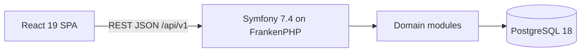

<p align="center">
  
</p>

<h1 align="center">Cadran Budget</h1>

<p align="center">Exact, explainable, self-hosted personal budgeting and wealth tracking.</p>

<p align="center">
  <a href="https://github.com/tblt-gr/cadran/actions/workflows/ci.yml"></a>
  <a href="https://symfony.com/"></a>
  <a href="https://react.dev/"></a>
  <a href="https://www.postgresql.org/"></a>
  <a href="./LICENSE"></a>
</p>

<hr>
<p align="center">
  <a href="#quick-start">Quick start</a> &bull;
  <a href="#vision">Vision</a> &bull;
  <a href="#principles">Principles</a> &bull;
  <a href="#architecture">Architecture</a> &bull;
  <a href="#roadmap">Roadmap</a> &bull;
  <a href="#development">Development</a> &bull;
  <a href="#contributing">Contributing</a>
</p>
<hr>

> [!IMPORTANT]
> Cadran Budget is in early development. The foundation increment is complete: the monorepo,
> hardened Docker runtime over local HTTPS, automated quality gates, the responsive application
> shell, same-origin session authentication with CSRF and login throttling, an append-only audit
> trail, workspace isolation proven by a CI guard, the asset reference, workspace categories, and
> the sourced system product catalogue. Accounts, transactions, budgets, reports, and portfolios are
> still to come. The quick start below boots the current stack.

## Quick start

Requirements: Docker with the Compose plugin and GNU Make. Everything else runs inside the pinned
`cadran_tools` image.

```bash
git clone https://github.com/tblt-gr/cadran.git
cd cadran
make init
```

`make init` writes `.env.local`, generates the local `var/docker-secrets/*` secrets, builds the
`cadran_app` and `cadran_db` images, applies database migrations, and brings the stack up on
<https://localhost:8443>.

Create the first owner, their workspace and their password (one-time; a second run is rejected).
The command prompts for every value, including a hidden password, so nothing lands in the shell
history:

```bash
make setup
```

The stack serves local HTTPS through an internal Caddy authority. Export and trust its root
certificate so the browser accepts the site:

```bash
make tls-certificate   # writes var/tls/cadran-local-ca.crt
```

Then open <https://localhost:8443> and sign in with the provisioned owner.

Day-to-day:

```bash
make up      # start the stack
make down    # stop the stack
make status  # container healthcheck
```

Override `CADRAN_HTTPS_PORT`, `CADRAN_HTTPS_BIND`, or `CADRAN_SERVER_NAME` in `.env.local` to
change the published address.

## Vision

Cadran Budget replaces a personal budgeting and wealth-tracking spreadsheet with a responsive,
self-hosted web application. Every metric must remain traceable to the source movements that
produced it without sacrificing the precision of imported data.

The target scope includes:

- accounts, balances, valuations, and net wealth;
- transactions, splits, transfers, refunds, and reconciliation;
- monthly, annual, and multi-year budgets and reports;
- savings goals and emergency-fund tracking;
- portfolios, life-insurance contracts, and qualified performance metrics;
- controlled Excel and CSV history imports;
- tax tracking without producing an official tax return.

Bank synchronization, multi-user support, real-time market prices, and native mobile applications
are outside the MVP.

## Principles

- **Accuracy first:** no amount, rate, price, or return is calculated with binary floating point.
- **Explainable metrics:** formulas, scope, dates, quality, and source records remain accessible.
- **Separate concepts:** expenses, transfers, savings contributions, and market performance are
  never conflated.
- **Data ownership:** PostgreSQL is the source of truth, with documented backup, restore, and export
  paths.
- **KISS before sophistication:** use a modular monolith, synchronous operations by default, and
  abstractions only for stable needs.
- **Continuous security and accessibility:** OWASP ASVS 5.0 and WCAG 2.2 AA are part of every
  vertical increment.

## Architecture



The monorepo layout is:

```text
apps/api/src/Module/  one folder per domain module, each split into
                      Domain, Application, Infrastructure and UI
apps/api/migrations/  versioned schema, replayed from empty on every pull request
apps/web/src/         React SPA: components/layout, components/ui, features, hooks, lib, styles
packages/api-client/  TypeScript client generated from OpenAPI, never hand-written
docker/               container definitions and runtime configuration
scripts/              architecture, workspace-scope and infrastructure guards
```

| Layer      | Technology                                                    |
| ---------- | ------------------------------------------------------------- |
| Backend    | PHP 8.5, Symfony 7.4 LTS, Doctrine DBAL and Migrations        |
| API        | REST `/api/v1`, OpenAPI 3.1, RFC 9457 errors                  |
| Frontend   | React 19, strict TypeScript, Vite, TanStack Query, i18next    |
| Data       | PostgreSQL 18, `NUMERIC(50,24)` for financial values          |
| Interface  | CSS Modules over a single design-token sheet, dark by default |
| Operations | Docker Compose, Caddy and FrankenPHP in one hardened image    |

Every Docker image and container name must start with `cadran_` so it remains immediately
identifiable on hosts running multiple stacks.

Persistence deliberately stops at Doctrine DBAL: the financial invariants live in value objects and
explicit SQL rather than in an ORM mapping, which keeps `NUMERIC(50,24)` exact from the column to
the API response. Repositories are guarded in CI — a statement that reads a workspace-scoped table
without filtering on `workspace_id` fails the build. API Platform was evaluated and not retained
for the MVP; controllers adapt HTTP to explicit use cases instead.

## Roadmap

Development follows demonstrable vertical increments:

1. ✅ foundation, identity, and reference data;
2. accounts, net wealth, and exact transactions; ← in progress
3. reconciliation, monthly budgeting, and history import;
4. reports, goals, and portfolios;
5. performance, life insurance, and tax tracking;
6. PWA delivery, backups, accessibility, and hardening;
7. bank synchronization and multi-user support only after an explicit decision.

Increment 1 ships the runnable foundation: a workspace every record belongs to, an authenticated
session, an audit trail, exact decimals end to end, categories, and the system product catalogue.
Archiving journeys and the "cannot be deleted while in use" rule land with increment 2, once a
transaction can mark a category or a product in use.

Each sprint must produce a runnable, tested, demonstrable version. Formatting, static analysis,
tests, migrations, API contracts, security controls, accessible states, and representative demo
data form the common exit gate.

## Development

### Local commands

Requirements: Docker with the Compose plugin, GNU Make, Node.js 22.22 or newer, and pnpm 9 or
newer. Every `make` target runs inside the pinned `cadran_tools` image so the toolchain is
identical on every machine.

```bash
make init       # dependencies, containers, database, migrations on a clean machine
make up         # start the stack over local HTTPS
make down       # stop the stack
make status     # container healthcheck
make quality    # formatting, static analysis, module boundaries, types, OpenAPI, infrastructure
make test       # module-boundary, infrastructure, backend (PHPUnit) and frontend (Vitest) tests
make e2e        # optional browser smoke scaffold against the running stack (Linux host)
make audit      # Composer and npm dependency audits
make build      # production build of both applications
```

Narrower targets exist for a tighter loop: `make architecture` runs the module-boundary and
workspace-scope guards alone, `make test-api` and `make test-web` run one side of the suite,
`make generate` regenerates the TypeScript client from OpenAPI, `make migrate` applies pending
migrations, and `make tls-certificate` exports the local certificate authority.

A fresh install has no user until the first owner, workspace and password are set up. The command
prompts for every value; it is a one-time action and a second run is rejected.

```bash
make setup
```

Expired transaction idempotency keys are retained for seven days. Run the following command from
the application container on a schedule; it removes records in repeatable batches of 1,000 and
reports the number removed:

```bash
docker compose exec app php apps/api/bin/console cadran:transactions:purge-idempotency-keys
```

Documentation and contract checks also run without Docker:

```bash
pnpm install    # also enables the local Git hooks
pnpm quality    # formatting, linting, OpenAPI lint and type checks
pnpm lint:docs  # validate published Markdown
```

`pnpm install` enables the local Git hooks. They format and validate staged files, enforce
Conventional Commits, and block direct pushes to `main` on the official repository.

`make e2e` runs the optional browser suite in a container on the host network, so it currently
expects a Linux host. It is not a pull-request gate before v1.0.0; browser E2E coverage enters the
quality process once stable critical journeys exist. `make db-backup` and
`make db-restore FILE=...` arrive with the backup capability in a later sprint.

### Project documents

| Document                                   | Purpose                                         |
| ------------------------------------------ | ----------------------------------------------- |
| [CONTRIBUTING.md](./CONTRIBUTING.md)       | Workflow for issues, commits, and reviews       |
| [CODE_OF_CONDUCT.md](./CODE_OF_CONDUCT.md) | Expected community behavior                     |
| [SECURITY.md](./SECURITY.md)               | Private reporting and security scope            |
| [SUPPORT.md](./SUPPORT.md)                 | Support channels and data-sanitization guidance |
| [CHANGELOG.md](./CHANGELOG.md)             | Notable unreleased and released changes         |

### Releases

The release workflow is installed but remains dormant until a signed `vMAJOR.MINOR.PATCH` tag
matching the root package version is pushed from a successful commit already merged into `main`.

## Contributing

Contributions are welcome. Read the [contributing guidelines](./CONTRIBUTING.md),
[Code of Conduct](./CODE_OF_CONDUCT.md), and [Security Policy](./SECURITY.md) before opening an issue
or pull request.

## License

[MIT](./LICENSE) © 2026 tblt-gr.
